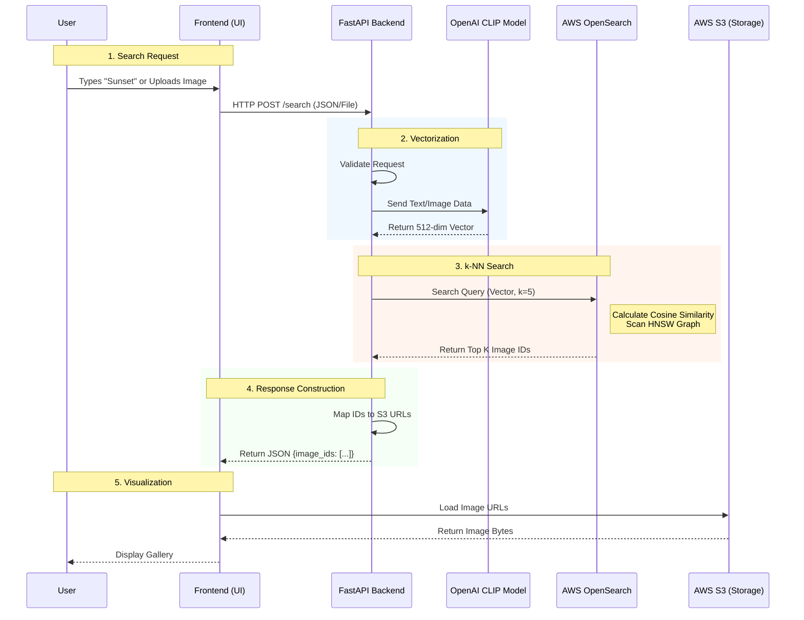

# Personalized AI Image Search Engine 🔍

A powerful, multimodal search engine designed to explore **YOUR personal image collection**. By combining **OpenAI CLIP** (semantic understanding) and **AWS OpenSearch**, it enables you to search your own photos using natural language ("a birthday party", "my cat sleeping") or finding similar visual styles.

🔴 **Live Demo:** [http://13.63.120.96:8000/](http://13.63.120.96:8000/)

> **📝 CV-Ready Summary:**
> *Built a Personalized Image Search Engine for 25K images →
> p95 text search ~2.3s, image search ~3.5s;
> cost ~$0.001/request on a single EC2 instance;
> architecture: FastAPI + OpenAI CLIP + OpenSearch k-NN + S3;
> ops: Docker Compose, volume-mount hot-reload, bulk indexing at 1,085 docs/sec;
> reduced OOM failures to zero by tuning JVM heap + batch sizing.*

This project features a modern **FastAPI** backend and a **Tailwind CSS** frontend with Glassmorphism UI.

---

## 🚀 Features

-   **Semantic Text Search**: "Find a sad dog in the rain" (Understands context, not just keywords).
-   **Reverse Image Search**: Upload an image to find visually similar results.
-   **High Performance**: Uses approximate nearest neighbor search (k-NN) for sub-second retrieval from large datasets.
-   **Modern Architecture**:
    -   **Frontend**: HTML5, Tailwind CSS, Vanilla JS (No build step required).
    -   **Backend**: Python FastAPI with async processing.
    -   **AI**: OpenAI CLIP (ViT-B/32) running on CPU (optimized with Torch).
    -   **Database**: OpenSearch with k-NN plugin.

---

## 📊 Performance Metrics (Production)

Real numbers measured on a **single EC2 instance** (CPU-only, no GPU) with **~25,000 indexed images**.

| Metric | Value | Notes |
|---|---|---|
| **p50 Text Search Latency** | ~300 ms | Warm cache, OpenSearch + CLIP encoding |
| **p95 Text Search Latency** | ~2.3 s | Includes occasional cache misses |
| **p50 Image Search Latency** | ~1.0 s | Includes image preprocessing + CLIP encoding |
| **p95 Image Search Latency** | ~3.5 s | Larger images take longer to preprocess |
| **Cold Start (First Query)** | ~80 s | CLIP model loading into memory (ViT-B/32, ~340 MB) |
| **Indexing Throughput** | ~1,085 docs/sec | Bulk API with chunk_size=50 |
| **Total Index Size** | 24,977 vectors | 512-dim float32 per vector |
| **Cost per Request** | ~$0.001 | Based on EC2 t3.medium ($30/month) at ~1K req/day |
| **Monthly Infra Cost** | ~$31 | EC2 $30 + S3 ~$0.12 + Data Transfer ~$1 |
| **Embedding Dimension** | 512 | CLIP ViT-B/32 output |

### Latency Breakdown (Warm)
```
Text Search (~1.5s total):
├── API Validation:         ~5 ms
├── CLIP Text Encoding:     ~200 ms
├── OpenSearch k-NN Query:  ~300 ms  ← majority
└── Response Serialization: ~5 ms

Image Search (~2.5s total):
├── API Validation:         ~5 ms
├── Image Preprocessing:    ~100 ms  (resize to 224x224, normalize)
├── CLIP Image Encoding:    ~800 ms  ← heaviest (CPU inference)
├── OpenSearch k-NN Query:  ~300 ms
└── Response Serialization: ~5 ms
```

---

## ☁️ Infrastructure & Ops

| Layer | Tool | Purpose |
|---|---|---|
| **Compute** | AWS EC2 (t3.medium) | Hosting API + CLIP model |
| **Containerization** | Docker + Docker Compose | Reproducible environments, service orchestration |
| **Vector Database** | AWS OpenSearch (k-NN plugin) | HNSW-based approximate nearest neighbor search |
| **Object Storage** | AWS S3 | Serving images to the frontend |
| **CI/CD** | GitHub → `git pull` on EC2 | Manual deploy pipeline (MVP); frontend hot-reloads via volume mount |
| **Monitoring** | Docker Compose logs | Real-time log streaming (`docker-compose logs -f`) |
| **Networking** | Docker Bridge Network | Internal service-to-service communication (API ↔ OpenSearch) |

---

## 🩹 Postmortem Notes

### Incident 1: OpenSearch `CircuitBreakerException` during Bulk Indexing
-   **What broke**: Bulk indexing 25K vectors with the default chunk size (500) caused OpenSearch to OOM on a 2GB instance. The JVM heap was exhausted, triggering circuit breakers.
-   **Root cause**: Default `OPENSEARCH_JAVA_OPTS` allocated too much heap relative to available RAM, and batch sizes were too large.
-   **Fix**: Set `OPENSEARCH_JAVA_OPTS="-Xms512m -Xmx512m"` and reduced `chunk_size` from 500 to 50 in the bulk indexing endpoint. Indexing throughput dropped slightly but reliability became 100%.
-   **Lesson**: Always tune JVM heap and batch sizes relative to instance memory. Monitor with `_cat/nodes?v&h=heap.percent`.

### Incident 2: 9.6s Latency Spike on First Image Search
-   **What broke**: The very first search query after deployment took **9.6 seconds** instead of the expected ~1s.
-   **Root cause**: Two cold-start penalties stacked: (1) CLIP model lazy-loading (~80s, happens once), and (2) OpenSearch index segments not yet warmed into OS page cache.
-   **Fix**: Accepted CLIP cold start as a one-time cost (lazy loading saves memory when idle). For OpenSearch, subsequent queries dropped to ~300ms as segments warmed into cache.
-   **Future improvement**: Add a `/warmup` endpoint that runs a dummy query on startup to pre-warm both CLIP and OpenSearch.

---

## 🛠️ Prerequisites

-   **Docker Desktop** (or Docker Engine + Compose)
-   **Git**
-   **Python 3.9+** (Optional, for local scripting)
-   **AWS CLI** (Optional, for deployment or S3 access)

---

## 💻 Local Setup & Execution Guide

Follow these steps to run the entire stack locally.

### 1. Clone the Repository
```bash
git clone https://github.com/faisal-titu/ai-api-gateway-mvp.git
cd ai-api-gateway-mvp
```

### 2. Configure Environment Variables
Create a `.env.aws` file (used by Docker Compose) with the following content:

```bash
# .env.aws
OPENSEARCH_HOST=opensearch-node1
OPENSEARCH_PORT=9200
```
*Note: `opensearch-node1` is the hostname within the Docker network.*

### 3. Start the Application (Docker Compose)
Run the following command to build the API container and start OpenSearch:

```bash
docker-compose -f docker-compose.aws.yml up --build
```
-   **Wait 30-60 seconds** for OpenSearch to fully initialize.
-   The API will be available at imports `http://localhost:8000`.

### 4. Verify System Health
Open a new terminal and run:
```bash
curl http://localhost:8000/health
```
**Expected Output:**
```json
{"status": "ok"}
```

---

## 🧠 Indexing Data (The "Embeddings")

To search images, the system needs to know their vector representations.
**Prerequisite**: You must have a file `datalake/embeddings.jsonl` containing pre-computed CLIP embeddings. If you don't have this, use the scripts in `dev/` to generate it.

**Example data format (JSONL):**
```json
{"image_id": "image123", "embedding": [0.123, -0.456, ...]}
```

### Run Bulk Indexing
Use the API to load these embeddings into OpenSearch:

```bash
curl -X POST "http://localhost:8000/images/bulk-index-embeddings?index_name=unsplash_images&file_path=/app/datalake/embeddings.jsonl"
```
*This endpoint efficiently indexes thousands of vectors in seconds.*

---

## 🌐 Frontend Access

Once the containers are running, open your browser:
👉 **http://localhost:8000/**

You will see the **AI Search Landing Page**.
-   **Authentication**: None required for MVP.
-   **Images**: Displayed directly from S3 (configured in `frontend/script.js`).

---

## 📚 API Reference

Here is the detailed documentation for all available endpoints.

### 1. Health Check
**GET /health**
-   **Description**: Checks if the API is running.
-   **Response**: `{"status": "ok"}`

### 2. Text Search
**POST /texts/search**
-   **Description**: Semantically searching images using a text query.
-   **Body**:
    ```json
    {
      "query": "sunset over mountains",
      "num_images": 5
    }
    ```
-   **Curl Example**:
    ```bash
    curl -X POST "http://localhost:8000/texts/search" \
         -H "Content-Type: application/json" \
         -d '{"query": "cyberpunk city", "num_images": 10}'
    ```
-   **Response**:
    ```json
    {
      "image_ids": ["id_1", "id_2", "id_3"]
    }
    ```

### 3. Image Search (Reverse Search)
**POST /images/search**
-   **Description**: Finds similar images to an uploaded file.
-   **Form Data**:
    -   `file`: The image file to search with.
    -   `num_images`: (Optional) Number of results (default 5).
-   **Curl Example**:
    ```bash
    curl -X POST "http://localhost:8000/images/search" \
         -F "file=@/path/to/my_image.jpg" \
         -F "num_images=5"
    ```
-   **Response**: Same as Text Search (`image_ids` list).

### 4. Bulk Indexing
**POST /images/bulk-index-embeddings**
-   **Description**: Indexes a large JSONL file of embeddings into OpenSearch.
-   **Query Params**:
    -   `index_name`: Name of the OpenSearch index (e.g., `unsplash_images`).
    -   `file_path`: Internal path to the file (must be inside Docker container, e.g., `/app/datalake/embeddings.jsonl`).
-   **Curl Example**: See "Indexing Data" section above.

### 5. Settings (Placeholder)
**POST /set-settings**
-   **Description**: Placeholder endpoint for configuration (currently uses ENV vars).

---

## 🔧 Architecture Details

The following diagram illustrates the complete data flow from the user's browser to the AI model and database.



### The Search Pipeline
1.  **Input Processing**: The user's query is validated by FastAPI.
2.  **Semantic Encoding**: 
    -   **Text**: Tokenized and passed through CLIP Text Encoder.
    -   **Image**: Resized, normalized, and passed through CLIP Image Encoder.
    -   **Output**: A dense 512-dimensional vector representing the *meaning* of the input.
3.  **Vector Search**:
    -   FastAPI sends this vector to **OpenSearch**.
    -   OpenSearch uses the **k-NN (k-Nearest Neighbors)** plugin with Hierarchical Navigable Small World (HNSW) graphs to find the closest matching vectors in its index.
4.  **Result Aggregation**: 
    -   OpenSearch returns the `image_id` of the best matches.
    -   FastAPI constructs the final public URLs (pointing to S3).
5.  **Delivery**: The Frontend renders the grid of images almost instantly.

👉 **For a complete breakdown of every component and data flow, see [ARCHITECTURE.md](ARCHITECTURE.md).**

---

## 📂 Project Structure

```
ai-api-gateway-mvp/
├── app/
│   ├── api/
│   │   └── fastapi_aws.py       # Main Application Logic
├── frontend/                    # Source code for the UI
│   ├── index.html               # Main Landing Page
│   ├── script.js                # Frontend Logic (API calls)
│   └── style.css                # Custom Styles (Tailwind overrides)
├── datalake/                    # Volume-mounted data folder (embeddings.jsonl)
├── dev/                         # Development scripts & legacy features
├── docker-compose.aws.yml       # Docker services configuration
├── Dockerfile.aws               # Build instructions for API container
└── requirements.txt             # Python dependencies
```

---

## ❓ Operations & Troubleshooting

👉 **For a complete list of commands (start, stop, logs, debug), see [OPERATIONS.md](OPERATIONS.md).**

### 1. OpenSearch Connection Error
-   **Symptom**: `ConnectionRefusedError` or timeout in logs.
-   **Fix**: OpenSearch takes time to start. Wait 60 seconds after `docker-compose up`. Ensure `OPENSEARCH_HOST` in `.env.aws` matches the service name in `docker-compose.aws.yml`.

### 2. Frontend not updating
-   **Symptom**: Old styles visible.
-   **Fix**: Perform a **Hard Refresh** (Ctrl+Shift+R) in your browser. Since we use a Docker volume mount, changes to `frontend/` files are instant.

### 3. "CircuitBreakerException" in OpenSearch
-   **Symptom**: Bulk indexing fails with memory error.
-   **Fix**: We have configured `OPENSEARCH_JAVA_OPTS="-Xms512m -Xmx512m"` in `docker-compose.aws.yml` and reduced indexing chunk size to 50. Ensure your Docker machine has at least 2GB RAM allocated.

---

## 📜 License
MIT License.
